# Resume Screening ATS - Complete Project Guide

A comprehensive guide for understanding this AI-powered Applicant Tracking System (ATS) that automatically screens and ranks resumes against job descriptions.

---

## 📋 Table of Contents

1. [Project Overview](#project-overview)
2. [Tech Stack Explained](#tech-stack-explained)
3. [Architecture Diagram](#architecture-diagram)
4. [Project Structure](#project-structure)
5. [Recommended File Reading Order](#recommended-file-reading-order)
6. [Detailed File Explanations](#detailed-file-explanations)
7. [Data Flow](#data-flow)
8. [How to Run](#how-to-run)

---

## Project Overview

### What Does This App Do?

This is an **AI-powered Resume Screening System** that:

1. **Takes a Job Description (JD)** → AI extracts required skills, experience, education
2. **Accepts Candidate Data** → Via Google Sheets file upload (Excel/CSV)
3. **Fetches Resumes** → Automatically downloads from Google Drive links
4. **Extracts Text** → From PDF, DOCX, or images (using OCR)
5. **Scores Candidates** → AI compares resume against JD requirements
6. **Ranks & Displays** → Shows ranked candidates with detailed explanations

### Key Features

| Feature | Description |
|---------|-------------|
| AI Scoring | Uses Groq LLM (Llama/Mixtral) to analyze and score resumes |
| Multi-format Support | PDF, DOCX, JPG, PNG (with OCR) |
| Google Drive Integration | Fetches resumes directly from Drive links |
| Batch Processing | Process entire Google Sheet of candidates at once |
| Detailed Explanations | Shows strengths, weaknesses, and recommendations |

---

## Tech Stack Explained

### Backend (Python)

| Technology | Purpose | Why Used |
|------------|---------|----------|
| **FastAPI** | Web framework | Modern, fast, automatic API docs, async support |
| **Uvicorn** | ASGI server | Runs FastAPI apps, supports hot reload |
| **Pydantic** | Data validation | Type-safe schemas, automatic validation |
| **Groq** | LLM API client | Fast AI inference for scoring resumes |
| **PyPDF2/pdfplumber** | PDF parsing | Extract text from PDF resumes |
| **python-docx** | Word parsing | Extract text from DOCX resumes |
| **pytesseract** | OCR | Extract text from image-based resumes |
| **pandas** | Data processing | Parse Excel/CSV files |
| **google-api-python-client** | Google APIs | Access Google Drive for resume download |

### Frontend (JavaScript)

| Technology | Purpose | Why Used |
|------------|---------|----------|
| **React** | UI library | Component-based, reactive updates |
| **Vite** | Build tool | Fast dev server, hot module replacement |
| **Tailwind CSS** | Styling | Utility-first CSS, rapid styling |
| **Axios** | HTTP client | Make API calls to backend |
| **Lucide React** | Icons | Clean, customizable icons |

---

## Architecture Diagram


---

## Project Structure

```
resume-screening-ats/
├── backend/                    # Python FastAPI Backend
│   ├── app/
│   │   ├── __init__.py
│   │   ├── config.py          # ⚙️ Configuration settings
│   │   ├── main.py            # 🚀 API endpoints (entry point)
│   │   ├── models/
│   │   │   ├── __init__.py
│   │   │   └── schemas.py     # 📝 Data models (Pydantic)
│   │   ├── services/
│   │   │   ├── __init__.py
│   │   │   ├── text_extractor.py    # 📄 Extract text from files
│   │   │   ├── groq_service.py      # 🤖 AI scoring with Groq
│   │   │   ├── google_drive_service.py   # ☁️ Google Drive API
│   │   │   └── google_sheets_service.py  # 📊 Google Sheets API
│   │   └── utils/
│   │       ├── __init__.py
│   │       └── logger.py      # 📋 Logging utilities
│   ├── tests/                 # Unit tests
│   ├── .env                   # 🔐 Environment variables
│   ├── credentials.json       # 🔑 Google service account key
│   └── requirements.txt       # 📦 Python dependencies
│
├── frontend/                  # React Frontend
│   ├── src/
│   │   ├── App.jsx           # 🖥️ Main React component
│   │   ├── main.jsx          # Entry point
│   │   └── index.css         # Global styles
│   ├── index.html            # HTML template
│   ├── package.json          # 📦 Node dependencies
│   ├── vite.config.js        # Vite configuration
│   ├── tailwind.config.js    # Tailwind configuration
│   └── postcss.config.js     # PostCSS configuration
│
└── venv/                      # Python virtual environment
```

---

## Recommended File Reading Order

### Phase 1: Understand Configuration & Setup (15 mins)

| Order | File | What You'll Learn |
|-------|------|-------------------|
| 1 | `backend/requirements.txt` | All Python dependencies used |
| 2 | `backend/.env` | Environment variables (API keys, settings) |
| 3 | `backend/app/config.py` | How settings are loaded and validated |
| 4 | `frontend/package.json` | Frontend dependencies |

### Phase 2: Understand Data Models (10 mins)

| Order | File | What You'll Learn |
|-------|------|-------------------|
| 5 | `backend/app/models/schemas.py` | All data structures (Candidate, Scores, etc.) |

### Phase 3: Understand Core Services (30 mins)

| Order | File | What You'll Learn |
|-------|------|-------------------|
| 6 | `backend/app/services/text_extractor.py` | How PDF/DOCX/Images are converted to text |
| 7 | `backend/app/services/groq_service.py` | How AI scores resumes (prompts, parsing) |
| 8 | `backend/app/services/google_drive_service.py` | How files are downloaded from Google Drive |
| 9 | `backend/app/utils/logger.py` | How logging is configured |

### Phase 4: Understand API Endpoints (20 mins)

| Order | File | What You'll Learn |
|-------|------|-------------------|
| 10 | `backend/app/main.py` | All API routes, how everything connects |

### Phase 5: Understand Frontend (20 mins)

| Order | File | What You'll Learn |
|-------|------|-------------------|
| 11 | `frontend/src/main.jsx` | React app entry point |
| 12 | `frontend/src/App.jsx` | Complete UI logic and components |

---

## Detailed File Explanations

### Backend Files

#### `backend/app/config.py`
**Purpose**: Centralizes all configuration using Pydantic Settings

```python
# Key concepts:
- Reads from .env file automatically
- Validates required settings on startup
- Provides typed access: settings.GROQ_API_KEY
```

**Key Settings**:
- `GROQ_API_KEY` - API key for Groq LLM
- `GOOGLE_CREDENTIALS_PATH` - Path to service account JSON
- `MAX_FILE_SIZE` - Maximum upload size (default 10MB)
- `CORS_ORIGINS` - Allowed frontend origins

---

#### `backend/app/models/schemas.py`
**Purpose**: Defines all data structures using Pydantic

**Key Models**:
| Model | Purpose |
|-------|---------|
| `JobDescriptionCreate` | Input for setting JD |
| `CandidateCreate` | Input for creating candidate |
| `ScoringBreakdown` | Skills, experience, education scores |
| `ScoringExplanation` | Strengths, weaknesses, overall assessment |
| `UploadResponse` | Response after processing resume |

---

#### `backend/app/services/text_extractor.py`
**Purpose**: Extracts text from various document formats

**How It Works**:
```
Input File → Detect Format → Extract Text → Clean & Return

Formats supported:
├── PDF → PyPDF2 (text-based) or OCR (scanned)
├── DOCX → python-docx
└── Images (JPG/PNG) → pytesseract OCR
```

**Key Methods**:
- `extract(file_content, filename)` - Main entry point
- `_extract_from_pdf()` - PDF handling
- `_extract_from_word()` - DOCX handling
- `_extract_from_image()` - OCR for images

---

#### `backend/app/services/groq_service.py`
**Purpose**: Handles all AI operations using Groq

**Key Methods**:
| Method | Purpose |
|--------|---------|
| `score_candidate()` | Score resume against JD, return breakdown |
| `parse_job_requirements()` | Extract skills/experience from JD |
| `_build_scoring_prompt()` | Create prompt for AI |
| `_parse_scoring_response()` | Parse AI JSON response |

**Scoring Categories**:
- **Skills Match** (0-100): How well skills align
- **Experience Match** (0-100): Years and relevance
- **Education Match** (0-100): Degree requirements
- **Keywords Match** (0-100): Important terms found

---

#### `backend/app/services/google_drive_service.py`
**Purpose**: Download files from Google Drive

**How It Works**:
1. Takes Drive URL → Extracts file ID
2. Authenticates with service account
3. Downloads file content
4. Returns bytes + filename

**Key Methods**:
- `download_from_url(url)` - Main method
- `extract_file_id(url)` - Parse various URL formats
- `get_file_metadata(file_id)` - Get filename, size

---

#### `backend/app/main.py`
**Purpose**: Defines all API endpoints (the heart of the backend)

**Key Endpoints**:

| Endpoint | Method | Purpose |
|----------|--------|---------|
| `/api/jd/set` | POST | Set job description, extract requirements |
| `/api/candidates/upload` | POST | Upload single resume, score it |
| `/api/sheets/upload` | POST | Process Excel/CSV with Drive links |
| `/api/candidates` | GET | List all scored candidates |
| `/api/candidates/{id}` | GET | Get single candidate details |
| `/api/statistics` | GET | Get scoring statistics |
| `/api/sheets/failed` | GET | Get failed candidates for manual handling |

---

### Frontend Files

#### `frontend/src/main.jsx`
**Purpose**: React entry point - renders App into DOM

```jsx
// Simple: Just mounts the App component
ReactDOM.createRoot(document.getElementById('root')).render(<App />)
```

---

#### `frontend/src/App.jsx`
**Purpose**: The entire UI in one component

**Key Sections**:
| Section | Lines (approx) | Purpose |
|---------|----------------|---------|
| State Management | 1-30 | All useState hooks |
| API Functions | 30-250 | Functions to call backend |
| Helper Functions | 250-300 | Score colors, filtering |
| JSX UI | 300-900 | All visual components |

**UI Sections**:
1. **Header** - App title, backend status
2. **Job Description Input** - Set the JD
3. **Google Sheets Upload** - Upload Excel/CSV
4. **Failed Candidates** - Manual handling section
5. **Candidates Table** - Ranked list with scores
6. **Candidate Modal** - Detailed view with explanations

---

## Data Flow

### Complete Flow: From JD to Ranked Candidates

```mermaid
sequenceDiagram
    participant User
    participant Frontend
    participant Backend
    participant Groq AI
    participant Google Drive
    
    User->>Frontend: 1. Enter Job Description
    Frontend->>Backend: POST /api/jd/set
    Backend->>Groq AI: Parse JD requirements
    Groq AI-->>Backend: Skills, Experience, Education
    Backend-->>Frontend: JD Set ✓
    
    User->>Frontend: 2. Upload Google Sheet
    Frontend->>Backend: POST /api/sheets/upload
    
    loop For each candidate row
        Backend->>Google Drive: Download resume from link
        Google Drive-->>Backend: PDF/DOCX bytes
        Backend->>Backend: Extract text from file
        Backend->>Groq AI: Score resume vs JD
        Groq AI-->>Backend: Scores + Explanation
        Backend->>Backend: Store candidate
    end
    
    Backend-->>Frontend: Processing complete
    Frontend->>Backend: GET /api/candidates
    Backend-->>Frontend: Ranked candidate list
    User->>Frontend: 3. View results!
```



---

## How to Run

### Prerequisites

- Python 3.10+
- Node.js 18+
- Groq API key (free at console.groq.com)
- Google Cloud service account (for Drive access)

### Backend Setup

```bash
cd backend

# Create virtual environment
python -m venv ../venv
../venv/Scripts/activate  # Windows
# source ../venv/bin/activate  # Mac/Linux

# Install dependencies
pip install -r requirements.txt

# Set environment variables in .env
# GROQ_API_KEY=your_key_here

# Run server
python -m uvicorn app.main:app --reload --port 8000
```

### Frontend Setup

```bash
cd frontend

# Install dependencies
npm install

# Run dev server
npm run dev
```

### Access the App

- Frontend: http://localhost:5173
- Backend API: http://localhost:8000
- API Docs: http://localhost:8000/docs

---

## Quick Reference

### Environment Variables (backend/.env)

```env
GROQ_API_KEY=gsk_xxxxx          # Required - Groq API key
GOOGLE_CREDENTIALS_PATH=credentials.json
MAX_FILE_SIZE=10485760          # 10MB
CORS_ORIGINS=["http://localhost:5173"]
DEBUG=true
```

### Common Commands

| Task | Command |
|------|---------|
| Start backend | `cd backend && ..\venv\Scripts\python -m uvicorn app.main:app --reload` |
| Start frontend | `cd frontend && npm run dev` |
| Run tests | `cd backend && pytest` |
| Install new Python package | `..\venv\Scripts\pip install package_name` |

---

*Last Updated: January 2026*
